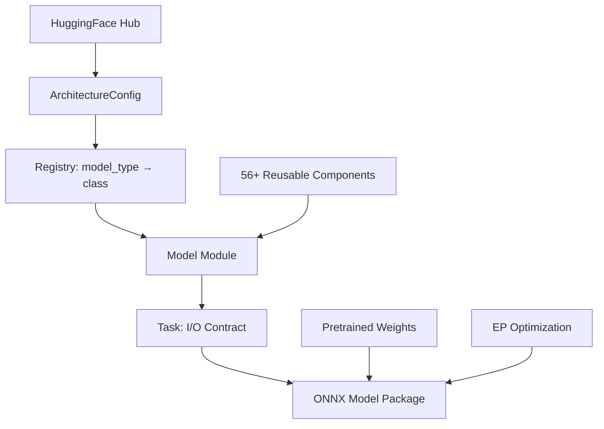
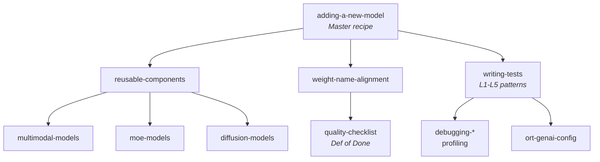

# Mobius

## Standardized ONNX Construction for GenAI at Scale

<div class="pt-6">
  <span class="text-xl text-gray-500">
    Justin Chu · Microsoft AI Frameworks
  </span>
</div>

<!--
At Microsoft, we use ONNX in two roles: as the starting point for optimizing AI models to run on devices, and as the format we deliver those optimized models in.

As a maintainer of the PyTorch to ONNX exporter — I share your pain. Model exporting is still hard.
-->

---
layout: center
---

# The Problem

<!--
[Visual break. 下一页的bullets展开痛点。]
-->

---

# The Challenge at Scale

<v-clicks>

- 🔥 **Dynamic shapes** — trace-time shapes baked in, workarounds everywhere
- 🔥 **Unsupported ops** — custom ops, control flow, Python-only logic
- 🔥 **Opset compatibility** — your model needs op18 but runtime supports op17
- 🔥 **Numerical drift** — "it exported but outputs are wrong"
- 🔥 **Models ship faster than anyone can keep up** — 130+ architectures and counting

</v-clicks>

<div v-click class="mt-8 text-center text-2xl font-bold text-blue-500">
At this scale, we need something different.
</div>

<!--
配合bullets展开每个痛点。最后一句是transition: 不是export不好，是规模到了这个程度需要另一种方式。
-->

---

# The Deeper Problem: Fragmentation

<v-clicks>

- 🧩 **No single source of truth** — same model, different ONNX graphs depending on who exported it
- 🧩 **Structural inconsistency** — CUDA export ≠ WebGPU export ≠ DirectML export
- 🧩 **Quality variance** — some exports work, some silently produce wrong outputs
- 🧩 **Duplicated effort** — every team re-discovers the same export pitfalls
- 🧩 **No composability** — can't share components across models when each is a one-off translation

</v-clicks>

<div v-click class="mt-8 p-4 bg-blue-50 rounded-lg text-center text-xl">
💡 We need <strong>one canonical construction</strong> per architecture.
</div>

<!--
从"export难"升维到"碎片化才是根因"。不是某个exporter的问题，是整个模式导致的——每个人各做各的，没有统一标准。
-->

---

# The Paradigm: Construction

<div class="grid grid-cols-2 gap-8 mt-8">

<div class="border-2 border-gray-300 rounded-lg p-4">

### Translation (Export)

```
PyTorch Model
    ↓ trace/script
Intermediate Repr
    ↓ convert ops
ONNX Graph
    ↓ fix shapes
ONNX Model
```

Great for general purpose.
Model-dependent. Hard to standardize.

</div>

<div class="border-2 border-green-300 rounded-lg p-4">

### ✅ Construction

```
HuggingFace Config
    ↓ read architecture
ONNX Graph (declarative)
    ↓ apply weights
ONNX Model
```

Deterministic. Composable.
**One canonical output per architecture.**

</div>

</div>

<!--
这里口头提Model Builder: "This idea isn't new — ORT GenAI Model Builder pioneered it and proved it works."

Construction不是否定export，是complementary。Export是general purpose翻译，Construction是standardization at scale。
-->

---

# From Curated to Community Scale

<div class="mt-4 text-lg">

Today we can build ~10 curated text generation and MoE models.<br>
But the HuggingFace ecosystem has **thousands** across every modality.

</div>

<v-click>

<div class="mt-6 text-center text-2xl font-bold text-blue-500">
How do we scale construction to the entire ecosystem?
</div>

</v-click>

<!--
Construction方向对了，但人手不够。10个curated模型用人工可以，thousands across 8+ modalities不行。观众现在理解了construction是什么，接下来的动画才有context。
-->

---

# The Scale: Visualized

<ScaleAnimation />

<!--
点击walk through动画。Phase 0: 现状~10个(text gen + MoE)。Phase 1: zoom out看到8个modality的完整版图。Phase 2: 亮起来——"With Mobius, we can scale across all of them."

停顿让观众消化。
-->

---
layout: center
class: text-center
---

# The Answer

<div class="text-2xl text-gray-500 mt-4">
Design construction for AI — from the ground up.
</div>

<!--
一句话把construction和AI绑在一起。不是"先做个build工具，再加AI"，是"从第一天开始就为AI agent开发而设计"。

To open the top of the funnel for the ONNX ecosystem, and to make device-targeted optimization easier, we need a way to scalably bring models into ONNX — and provide a stable, uniform representation as the starting point, regardless of model architecture.

That's what Mobius does.
-->

---

# What Is Mobius?

<div class="mt-4 text-lg">

**ONNX model definitions for GenAI using `onnxscript.nn`**

</div>

```python
from mobius import build

# That's it. One line.
pkg = build("meta-llama/Llama-3.2-1B")
pkg.save("output/llama/")
```

<v-clicks>

- 📦 **130+** Transformers model types
- 🎯 **56+** reusable components
- 🖥️ **EP-aware** optimization (CUDA, WebGPU, DirectML)
- 🧠 **Memory efficient** — builds 70B models in <100MB RAM

</v-clicks>

---

# Architecture



---

# Four-Layer Stack

| Layer | What | Example |
|-------|------|---------|
| **Components** | Model-agnostic building blocks | Attention, MLP, RMSNorm, RoPE, MoELayer |
| **Models** | Architecture-specific modules | LlamaCausalLM, Qwen3VL, DeepSeekV3 |
| **Tasks** | Define I/O contract + KV cache | CausalLMTask, VisionLanguageTask |
| **Registry** | Maps HF `model_type` → class | `"llama"` → `CausalLMModel` |

<div class="mt-6 text-center">

Many models need **one line** to register:

```python
registry.register("my_new_model", CausalLMModel)
```

</div>

---

# Memory Efficiency: Build 70B in <100MB

<v-clicks>

### The trick: shape-only parameters

```python
class Linear(nn.Module):
    def __init__(self, in_features, out_features):
        # ZERO bytes allocated! Only shape recorded.
        self.weight = nn.Parameter([out_features, in_features])
```

### Two-phase architecture

| Phase | Memory | What happens |
|-------|--------|-------------|
| **1. Graph Construction** | ~100MB | Shape-only placeholders, build full ONNX graph |
| **2. Weight Application** | Streaming | Download shards, apply via LazyTensor |

### `ir.LazyTensor` — deferred until serialization

- Dtype casts → closure, not immediate copy
- Transposes → lazy, folded at save time
- Tied embeddings → deduplicated via `data_ptr()`

</v-clicks>

---

# Designed for Parallel Development

<div class="mt-4 text-lg">

The architecture is **designed for parallel AI agent development**.

</div>

<v-clicks>

- 📁 **One model = one file** — no cross-model dependencies
- 🧩 **Shared components are stable** — compose from them, rarely need to change them
- 🧪 **Independent test suites** — each model validates in isolation
- 📚 **18 structured skills** — agents follow the same playbook humans would
- 📋 **Declarative golden tests** — adding coverage = adding a YAML file

</v-clicks>

---

# EP-Aware Optimization

```python
from mobius import build

# CUDA: GQA fusion, SkipLayerNorm, PackQKV
pkg = build("meta-llama/Llama-3.2-1B",
            execution_provider="cuda", dtype="f16")

# WebGPU: portable alternatives, no CUDA-only ops
pkg = build("meta-llama/Llama-3.2-1B",
            execution_provider="webgpu", dtype="f16")

# DirectML: Windows-optimized graph
pkg = build("meta-llama/Llama-3.2-1B",
            execution_provider="dml", dtype="f16")
```

<v-click>

Optimization happens **at build time**, not post-hoc. The graph is born ready for its target runtime.

</v-click>

<v-click>

<div class="mt-4 text-sm text-gray-500">

🔧 Under the hood: **10 declarative rewrite rules** (GQA fusion, SkipLayerNorm, BiasGeLU, PackedAttention, RoPE separation...) pattern-match and transform the graph — like LLVM passes for ONNX.

</div>

</v-click>

---
layout: center
class: text-center
---

# How AI Agents Use Mobius

<div class="text-2xl text-gray-500 mt-4">
The skills, the workflow, the verification.
</div>

---

# AI-Assisted Development

<div class="mt-4">

### 18 structured skills for AI agents

</div>



---

# What an Agent Does

<v-clicks>

1. **Read** HF `config.json` → identify architecture pattern
2. **Decide** — is it LLaMA-compatible? (→ 1 line) Or novel? (→ new components)
3. **Implement** — compose from existing components, add new ones if needed
4. **Map weights** — align HF checkpoint names → ONNX initializer names
5. **Test** — L1 through L5, self-verifying at each level
6. **Iterate** — fix numerical mismatches until parity

</v-clicks>

<div v-click class="mt-6 p-3 bg-green-50 rounded-lg">

**Key insight:** The composable architecture + consistent patterns make AI agents effective.
A human designs the system; AI scales it.

</div>

---

# L1–L5: The Testing Pyramid

<div class="mt-4">

How agents (and humans) verify correctness:

</div>

| Level | What | Speed | Where |
|-------|------|-------|-------|
| **L1** | Graph builds (smoke) | <10s, CPU | Every PR |
| **L2** | Real HF configs, no weights | ~1min, CPU | Nightly |
| **L3** | Synthetic parity (random weights) | ~2min, CPU | PR (affected) |
| **L4** | Golden checkpoint logits | GPU (A10) | PR + Nightly |
| **L5** | Full generation vs golden | GPU (A10) | PR + Nightly |

<div v-click class="mt-4 p-3 bg-yellow-50 rounded-lg">

🔑 **Diff-based CI**: AST analysis detects which models a code change affects → only those get retested. Core infra change? Run all.

</div>

---

# Why This Works for AI

<v-clicks>

### Agents can self-verify

- L1 fails → graph construction bug (shape mismatch, missing param)
- L3 fails → numerical error (wrong op, wrong axis, scaling bug)
- L4/L5 fails → weight loading or accumulation issue

### Each level is a clear diagnostic signal

The agent doesn't just run tests — it **knows what a failure means** and can fix it.

</v-clicks>

---

# Case Study: PersonaPlex

<div class="mt-4 text-lg">

An **audio-to-audio** model. Not text gen. Not vision. Something ONNX has rarely seen.

</div>

<v-clicks>

### The model

- NVIDIA's real-time full-duplex voice conversation model
- 7B parameters, Moshi architecture
- Audio in → Audio out (no STT→LLM→TTS pipeline)
- Full-duplex: both sides talk simultaneously, natural interruption

### What happened

- AI agent picked it up, classified it as novel (out-of-library)
- Composed new audio components + reused existing attention/norm building blocks
- Built end-to-end ONNX graph + streaming inference server
- **2–3 days**, fully tested, working demo

</v-clicks>

<div v-click class="mt-4 p-3 bg-green-50 rounded-lg text-center">

🎵 The system doesn't just handle <em>more text models</em>. It handles <strong>new modalities</strong> the same way.

</div>

---

# Out-of-Tree Models

<div class="mt-4 text-lg">

Third parties can build their private models with Mobius — and get the same optimized path for free.

</div>

```python
from mobius import registry
from mobius.components import Attention, RMSNorm, MLP, RotaryEmbedding

class MyProprietaryModel(CausalLMModel):
    # Compose from 56+ battle-tested components
    def __init__(self, config):
        self.attn = Attention(config)      # ← same as Llama/Qwen
        self.norm = RMSNorm(config)        # ← same as Gemma
        self.mlp = MLP(config)             # ← same as Phi
        self.rope = RotaryEmbedding(config)

registry.register("my_secret_model", MyProprietaryModel)
```

<v-clicks>

- 🔧 **Reusable components** — don't reinvent Attention/MLP/RoPE, just compose
- ⚡ **EP optimizations come free** — GQA fusion, SkipLayerNorm, etc. apply automatically
- 🔒 **Keep weights private** — only the architecture definition is needed at build time
- 📦 **Any weight format** — SafeTensors, PyTorch `.bin`, GGUF, NeMo → one canonical ONNX
- 🧪 **Same L1-L5 test infra** — validate your model with the same pipeline we use

</v-clicks>

<div v-click class="mt-6 p-3 bg-blue-50 rounded-lg text-center">

🔄 <strong>Flywheel:</strong> Third parties use components → find bugs, add ops → components get better → more models adopt them → repeat.

</div>

---

# Coverage

<div class="grid grid-cols-2 gap-6 mt-4">

<div>

| Category | Examples |
|----------|---------|
| **Text Gen** | Llama 2/3/4, Qwen 2-3.6, Phi, Gemma, GPT-2 |
| **MoE** | DeepSeek-V2/V3, Mixtral, Qwen-MoE, DBRX |
| **Multimodal** | Gemma 3, Phi-4MM, Qwen-VL, LLaVA |
| **Encoder** | BERT, RoBERTa, DeBERTa, XLNet |

</div>

<div>

| Category | Examples |
|----------|---------|
| **Enc-Dec** | T5, BART, Whisper, Marian |
| **Audio** | Wav2Vec2, HuBERT, SpeechT5, PersonaPlex |
| **Vision** | ViT, CLIP, SigLIP, DINOv2 |
| **Diffusion** | Stable Diffusion, Flux, SD3, DiT |

</div>

</div>

<div class="mt-6 text-center text-2xl font-bold">
130+ model types · 56+ components · 14 task types
</div>

---

# Summary

<v-clicks>

1. **Build for standardization** — declarative ONNX construction, one canonical output per architecture
2. **Memory efficient** — shape-only params + LazyTensor = build any model size
3. **AI-native** — 18 skills + L1-L5 testing let agents add models autonomously
4. **EP-aware** — born optimized for your target runtime
5. **Composable** — 56+ components shared across 130+ architectures

</v-clicks>

<div v-click class="mt-8 text-center text-xl">

Coming this summer. Pairs with Olive for end-to-end optimization.

</div>

---
layout: center
class: text-center
---

# Thank You

Questions?

<div class="mt-8 text-gray-500">
Justin Chu · justinchuby
</div>
