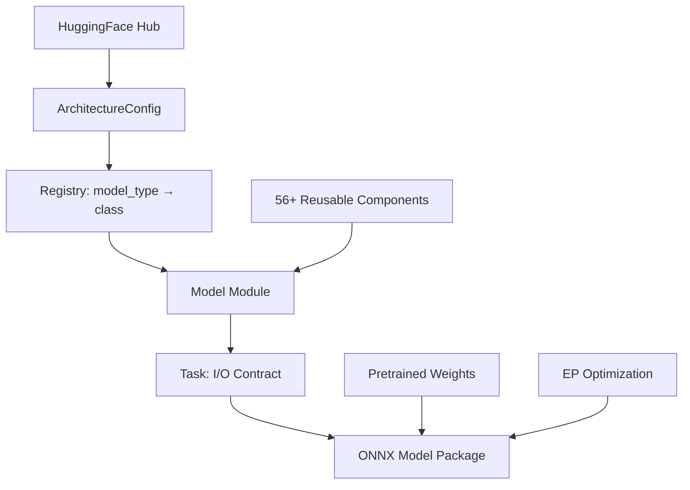

# Mobius

## Build ONNX Models, Don't Export Them

<div class="pt-6">
  <span class="text-xl text-gray-500">
    Justin Chu · Microsoft AI Frameworks
  </span>
</div>

<div class="abs-br m-6 flex gap-2">
  <a href="https://github.com/onnxruntime/mobius" target="_blank" class="text-xl slidev-icon-btn">
    <carbon-logo-github />
  </a>
</div>

---
layout: center
---

# The Problem

---

# Export Is Hard

<v-clicks>

- 🔥 **Dynamic shapes** — trace-time shapes baked in, workarounds everywhere
- 🔥 **Unsupported ops** — custom ops, control flow, Python-only logic
- 🔥 **Opset compatibility** — your model needs op18 but runtime supports op17
- 🔥 **Numerical drift** — "it exported but outputs are wrong"
- 🔥 **Models ship faster than we can export them** — 130+ architectures and counting

</v-clicks>

<div v-click class="mt-8 text-center text-2xl font-bold text-blue-500">
What if we stopped translating and started building?
</div>

---

# The Paradigm Shift

<div class="grid grid-cols-2 gap-8 mt-8">

<div class="border-2 border-red-300 rounded-lg p-4">

### ❌ Translation (Export)

```
PyTorch Model
    ↓ trace/script
Intermediate Repr
    ↓ convert ops
ONNX Graph
    ↓ fix shapes
ONNX Model (fingers crossed)
```

Fragile. Lossy. Model-dependent.

</div>

<div class="border-2 border-green-300 rounded-lg p-4">

### ✅ Construction (Mobius)

```
HuggingFace Config
    ↓ read architecture
ONNX Graph (declarative)
    ↓ apply weights
ONNX Model (correct by design)
```

Deterministic. Complete. Composable.

</div>

</div>

---

# What Is Mobius?

<div class="mt-4 text-lg">

**ONNX model definitions for GenAI using `onnxscript.nn`**

</div>

```python
from mobius import build

# That's it. One line.
pkg = build("meta-llama/Llama-3.2-1B")
pkg.save("output/llama/")
```

<v-clicks>

- 📦 **130+** Transformers model types
- 🎯 **56+** reusable components
- 🖥️ **EP-aware** optimization (CUDA, WebGPU, DirectML)
- 🧠 **Memory efficient** — builds 70B models in <100MB RAM

</v-clicks>

---

# Architecture



---

# Four-Layer Stack

| Layer | What | Example |
|-------|------|---------|
| **Components** | Model-agnostic building blocks | Attention, MLP, RMSNorm, RoPE, MoELayer |
| **Models** | Architecture-specific modules | LlamaCausalLM, Qwen3VL, DeepSeekV3 |
| **Tasks** | Define I/O contract + KV cache | CausalLMTask, VisionLanguageTask |
| **Registry** | Maps HF `model_type` → class | `"llama"` → `CausalLMModel` |

<div class="mt-6 text-center">

Many models need **one line** to register:

```python
registry.register("my_new_model", CausalLMModel)
```

</div>

---

# Memory Efficiency: Build 70B in <100MB

<v-clicks>

### The trick: shape-only parameters

```python
class Linear(nn.Module):
    def __init__(self, in_features, out_features):
        # ZERO bytes allocated! Only shape recorded.
        self.weight = nn.Parameter([out_features, in_features])
```

### Two-phase architecture

| Phase | Memory | What happens |
|-------|--------|-------------|
| **1. Graph Construction** | ~100MB | Shape-only placeholders, build full ONNX graph |
| **2. Weight Application** | Streaming | Download shards, apply via LazyTensor |

### `ir.LazyTensor` — deferred until serialization

- Dtype casts → closure, not immediate copy
- Transposes → lazy, folded at save time
- Tied embeddings → deduplicated via `data_ptr()`

</v-clicks>

---
layout: center
class: text-center
---

# The AI Story

<div class="text-2xl text-gray-500 mt-4">
This project can't exist without AI agents.
</div>

---

# The Scale Problem

<div class="grid grid-cols-2 gap-8 mt-8">

<div>

### Models ship fast

- 130+ architectures today
- New ones every week
- Variants, MoE, multimodal, hybrid...

</div>

<div>

### Humans don't scale

- Each model: read paper, impl, test, debug
- 2-5 days per model (manual)
- Team of ~5 contributors

</div>

</div>

<div v-click class="mt-8 p-4 bg-blue-50 rounded-lg text-center text-xl">
💡 Solution: Design the system so AI agents can reliably add models
</div>

---

# AI-Assisted Development

<div class="mt-4">

### 18 structured skills for AI agents

</div>

```
┌─────────────────────────────────────┐
│     adding-a-new-model              │  ← Master recipe
│  (step-by-step, checklist)          │
└─────────────────┬───────────────────┘
                  │
    ┌─────────────┼─────────────────┐
    │             │                 │
    ▼             ▼                 ▼
reusable      weight-name       writing-tests
components    alignment         (L1-L5 patterns)
    │             │                 │
    ▼             ▼                 ▼
multimodal    quality-         debugging-*
moe-models    checklist        profiling
diffusion     (Def of Done)    ort-genai-config
```

---

# What an Agent Does

<v-clicks>

1. **Read** HF `config.json` → identify architecture pattern
2. **Decide** — is it LLaMA-compatible? (→ 1 line) Or novel? (→ new components)
3. **Implement** — compose from existing components, add new ones if needed
4. **Map weights** — align HF checkpoint names → ONNX initializer names
5. **Test** — L1 through L5, self-verifying at each level
6. **Iterate** — fix numerical mismatches until parity

</v-clicks>

<div v-click class="mt-6 p-3 bg-green-50 rounded-lg">

**Key insight:** The composable architecture + consistent patterns make AI agents effective.
A human designs the system; AI scales it.

</div>

---

# L1–L5: The Testing Pyramid

<div class="mt-4">

How agents (and humans) verify correctness:

</div>

| Level | What | Speed | Where |
|-------|------|-------|-------|
| **L1** | Graph builds (smoke) | <10s, CPU | Every PR |
| **L2** | Real HF configs, no weights | ~1min, CPU | Nightly |
| **L3** | Synthetic parity (random weights) | ~2min, CPU | PR (affected) |
| **L4** | Golden checkpoint logits | GPU (A10) | PR + Nightly |
| **L5** | Full generation vs golden | GPU (A10) | PR + Nightly |

<div v-click class="mt-4 p-3 bg-yellow-50 rounded-lg">

🔑 **Diff-based CI**: AST analysis detects which models a code change affects → only those get retested. Core infra change? Run all.

</div>

---

# Why This Works for AI

<v-clicks>

### Agents can self-verify

- L1 fails → graph construction bug (shape mismatch, missing param)
- L3 fails → numerical error (wrong op, wrong axis, scaling bug)
- L4/L5 fails → weight loading or accumulation issue

### Each level is a clear diagnostic signal

The agent doesn't just run tests — it **knows what a failure means** and can fix it.

### Result: most models are added in < 30 minutes

(Including test generation, weight mapping, and L1-L5 validation)

</v-clicks>

---

# Multi-Agent Coordination

<div class="mt-4">

Real experience running **10-17 parallel agents** on the same repo:

</div>

<v-clicks>

- 🌳 **Git worktree isolation** — each agent gets its own working copy
- 📝 **Commit protocols** — structured messages, no conflicts
- 🔄 **Failure recovery** — agents retry with diagnostic context
- 📊 **Progress tracking** — centralized status across all agents

</v-clicks>

<div v-click class="mt-6 text-center text-lg">

One human orchestrating a fleet of agents → coverage that would take months done in days.

</div>

---

# EP-Aware Optimization

```python
from mobius import build

# CUDA: GQA fusion, SkipLayerNorm, PackQKV
pkg = build("meta-llama/Llama-3.2-1B",
            execution_provider="cuda", dtype="f16")

# WebGPU: portable alternatives, no CUDA-only ops
pkg = build("meta-llama/Llama-3.2-1B",
            execution_provider="webgpu", dtype="f16")

# DirectML: Windows-optimized graph
pkg = build("meta-llama/Llama-3.2-1B",
            execution_provider="dml", dtype="f16")
```

<v-click>

Optimization happens **at build time**, not post-hoc. The graph is born ready for its target runtime.

</v-click>

---
layout: center
---

# Demo

```bash
mobius build --model Qwen/Qwen2.5-0.5B output/ --ep cuda --dtype f16
```

---

# Coverage

<div class="grid grid-cols-2 gap-6 mt-4">

<div>

| Category | Examples |
|----------|---------|
| **Text Gen** | Llama 2/3/4, Qwen 2-3.6, Phi, Gemma, GPT-2 |
| **MoE** | DeepSeek-V2/V3, Mixtral, Qwen-MoE, DBRX |
| **Multimodal** | Gemma 3, Phi-4MM, Qwen-VL, LLaVA |
| **Encoder** | BERT, RoBERTa, DeBERTa, XLNet |

</div>

<div>

| Category | Examples |
|----------|---------|
| **Enc-Dec** | T5, BART, Whisper, Marian |
| **Audio** | Wav2Vec2, HuBERT, SpeechT5 |
| **Vision** | ViT, CLIP, SigLIP, DINOv2 |
| **Diffusion** | Stable Diffusion, Flux, SD3, DiT |

</div>

</div>

<div class="mt-6 text-center text-2xl font-bold">
130+ model types · 56+ components · 14 task types
</div>

---

# Summary

<v-clicks>

1. **Build, don't export** — declarative ONNX construction eliminates export fragility
2. **Memory efficient** — shape-only params + LazyTensor = build any model size
3. **AI-native** — 18 skills + L1-L5 testing let agents add models autonomously
4. **EP-aware** — born optimized for your target runtime
5. **Composable** — 56+ components shared across 130+ architectures

</v-clicks>

<div v-click class="mt-8 text-center">

### Get started

```bash
pip install mobius
mobius build --model <any-hf-model> output/
```

📖 [onnxruntime.github.io/mobius](https://onnxruntime.github.io/mobius/)
· 💻 [github.com/onnxruntime/mobius](https://github.com/onnxruntime/mobius)

</div>

---
layout: center
class: text-center
---

# Thank You

Questions?

<div class="mt-8 text-gray-500">
Justin Chu · justinchuby
</div>
