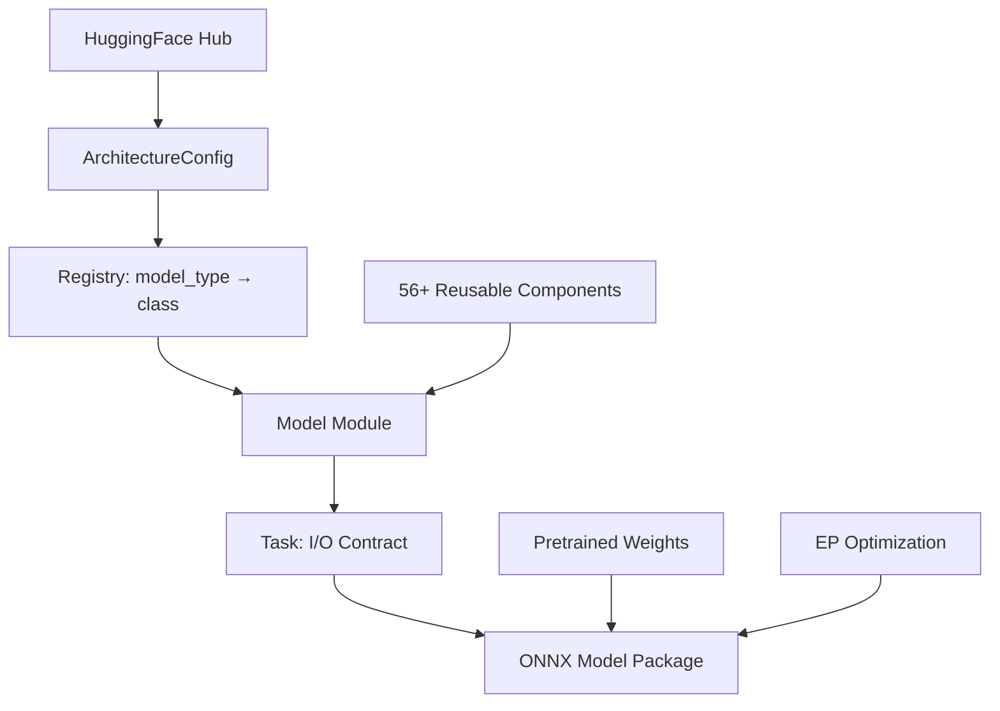
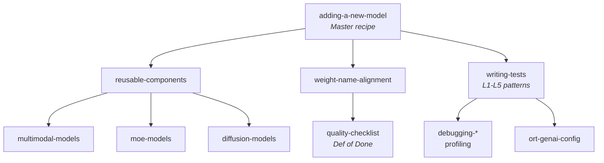

# Mobius

## Standardized ONNX Construction for GenAI at Scale

<div class="pt-6">
  <span class="text-xl text-gray-500">
    Justin Chu · Microsoft
  </span>
</div>

<!--
Hi, I am Justin, a software engineer at Microsoft working on our inference and optimization stack for edge AI.

At Microsoft, we use ONNX as both the starting point for optimizing AI models, and as the format we deliver those optimized models in.

To acquire those ONNX models, we have been relying on the PyTorch exporter to trace the model architecture and convert the operators into ONNX — typically starting from models on Hugging Face. As a maintainer of that exporter, I share your pain: model exporting is still hard.
-->

---
layout: center
---

# The Problem

<!--
[Visual break. The bullets on the next slide unpack the pain points.]
-->

---

# The Challenge at Scale

<v-clicks>

- 🔥 **Dynamic shapes** — shapes specialized at runtime, which breaks export
- 🔥 **Unsupported operators** — control flow, Python-only logic, new PyTorch ops
- 🔥 **Graph cleanup & node fusion** — patterns shift with `transformers` / PyTorch updates, and vary across models
- 🔥 **Signature / architecture changes** — input/output/tensor-layout tweaks to fit ONNX conventions
- 🔥 **Quantized models** — low-bit representations have no standard traceable form

</v-clicks>

<div v-click class="mt-8 text-center text-2xl font-bold text-blue-500">
At this scale, we need something different.
</div>

<!--
Walk through each pain point with the bullets. To convert a Hugging Face model into ONNX with the Torch exporter, every one of these can bite you. The last line is the transition: it's not that export is bad — it's that at this scale, with this much churn, we need a different approach.
-->

---

# The Deeper Problem: Fragmentation

<v-clicks>

- 🧩 **No single source of truth** — same model, different ONNX graphs depending on who exported it
- 🧩 **Structural inconsistency** — CUDA export ≠ WebGPU export ≠ CPU export
- 🧩 **Quality variance** — some exports work, some silently produce wrong outputs
- 🧩 **Duplicated effort** — every team re-discovers the same export pitfalls

</v-clicks>

<div v-click class="mt-8 p-4 bg-blue-50 rounded-lg text-center text-xl">
💡 We need <strong>one canonical construction</strong> per architecture.
</div>

<!--
Elevate from "export is hard" to "fragmentation is the root cause." It's not any single exporter's problem — it's the whole pattern: everyone does their own thing, with no shared standard.

All of this leads to longer development time, and we miss optimization opportunities whenever a model carries patterns the optimizers don't recognize. That's why we need a way to guarantee canonical constructions and avoid fragmentation.
-->

---

# The Paradigm: Construction

<div class="grid grid-cols-2 gap-8 mt-8">

<div class="border-2 border-gray-300 rounded-lg p-4">

### Translation (Export)

```
PyTorch Model
    ↓ trace
Intermediate Repr
    ↓ convert ops
ONNX Graph
    ↓ cleanup / fusion / graph transform
ONNX Model
```

Great for general purpose.
Model-code dependent. Hard to standardize.

</div>

<div class="border-2 border-green-300 rounded-lg p-4">

### ✅ Construction

```
HuggingFace Config
    ↓ read architecture
ONNX Graph (declarative)
    ↓ apply weights
ONNX Model
```

Deterministic. Composable.
**One canonical output per architecture.**

</div>

</div>

<!--
- Where translation is constrained by the modeling code and the PyTorch framework, construction goes the other way: we read what we know about the architecture and directly build the clean ONNX representation we expect.
- This idea isn't new — the Model Builder in ONNX Runtime GenAI pioneered it and proved it works.
- Construction doesn't negate export — it's complementary. Export is general-purpose translation; Construction is standardization at scale.
-->

---

# From Curated to Community Scale

<div class="mt-4 text-lg">

With Model Builder we can build ~20 text-to-text architectures.<br>
But the HuggingFace ecosystem has **300+** across every modality.

</div>

<v-click>

<div class="mt-6 text-center text-2xl font-bold text-blue-500">
How do we scale construction to the entire ecosystem?
</div>

</v-click>

<!--
Construction is the right direction, but there aren't enough hands. ~20 curated text-to-text models can be done manually; 300+ model types across 8+ modalities cannot. The audience now understands what construction is, which gives the upcoming animation its context.
-->

---

# The Scale: Visualized

<ScaleAnimation />

<!--
Click to walk through the animation. Phase 0: today, ~20 text-to-text models with Model Builder. Phase 1: zoom out to see the full landscape of 8 modalities. Phase 2: light it up — "With Mobius, we can scale across all of them."

Pause to let the audience absorb it.
-->

---
layout: center
class: text-center
---

# The Answer

<div class="text-2xl text-gray-500 mt-4">
Design construction for AI — from the ground up.
</div>

<!--
One line ties construction and AI together. Our answer: scale using AI agents, and design the system for agentic development from day one. It's not "build a tool first, then add AI" — it's "designed for AI agent development from day one."

To open the top of the funnel for the ONNX ecosystem, and to make device-targeted optimization easier, we need a way to scalably bring models into ONNX — and provide a stable, uniform representation as the starting point, regardless of model architecture.

That's what Mobius does.
-->

---

# What Is Mobius?

<div class="mt-4 text-lg">

**ONNX model definitions for GenAI using `onnxscript.nn`**

</div>

```python
from mobius import build

# That's it. One line.
pkg = build("meta-llama/Llama-3.2-1B")
pkg.save("output/llama/")
```

<v-clicks>

- 📦 **130+** Transformers model types
- 🎯 **56+** reusable components
- 🖥️ **EP-aware** optimization (CUDA, WebGPU, DirectML)
- 🧠 **Memory efficient** — builds 70B models in <100MB RAM

</v-clicks>

<!--
- Mobius = ONNX model definitions for GenAI, written with onnxscript.nn
- One call: build a HF model ID, save the package — weights downloaded & applied automatically
- Four proof points, unpacked next: 130+ model types, 56+ components, EP-aware, memory efficient
-->

---

# Architecture



<!--
- HF config → ArchitectureConfig → registry maps model_type → model class
- Model composed from shared components; Task defines I/O contract (inputs, outputs, KV cache)
- Weights + EP optimization → final ONNX package
- Every box is a stable seam — swap a model without touching components
-->

---

# Four-Layer Stack

| Layer | What | Example |
|-------|------|---------|
| **Components** | Model-agnostic building blocks | Attention, MLP, RMSNorm, RoPE, MoELayer |
| **Models** | Architecture-specific modules | LlamaCausalLM, Qwen3VL, DeepSeekV3 |
| **Tasks** | Define I/O contract + KV cache | CausalLMTask, VisionLanguageTask |
| **Registry** | Maps HF `model_type` → class | `"llama"` → `CausalLMModel` |

<div class="mt-6 text-center">

Many models need **one line** to register:

```python
registry.register("my_new_model", CausalLMModel)
```

</div>

<!--
- Components: model-agnostic building blocks
- Models: architecture-specific compositions
- Tasks: I/O contract + KV cache
- Registry: HF model_type → class
- Most models are LLaMA-shaped → one registry line; that's why coverage scales
-->

---

# Memory Efficiency: Build 70B in <100MB

<v-clicks>

### The trick: shape-only parameters

```python
class Linear(nn.Module):
    def __init__(self, in_features, out_features):
        # ZERO bytes allocated! Only shape recorded.
        self.weight = nn.Parameter([out_features, in_features])
```

### Two-phase architecture

| Phase | Memory | What happens |
|-------|--------|-------------|
| **1. Graph Construction** | ~100MB | Shape-only placeholders, build full ONNX graph |
| **2. Weight Application** | Streaming | Download shards, apply via LazyTensor |

### `ir.LazyTensor` — deferred until serialization

- Dtype casts → closure, not immediate copy
- Transposes → lazy, folded at save time
- Tied embeddings → deduplicated via `data_ptr()`

</v-clicks>

<!--
- We build a graph, not run a model → params need shape, not data (Linear = zero bytes)
- Two phases: build full graph with shape-only placeholders (~100MB), then stream weights in lazily
- ir.LazyTensor defers casts, transposes, tied-weight dedup until serialization
- Result: 70B model builds in <100MB RAM — on a laptop
-->

---

# Designed for Parallel Development

<div class="mt-4 text-lg">

The architecture is **designed for parallel AI agent development**.

</div>

<v-clicks>

- 📁 **One model = one file** — no cross-model dependencies
- 🧩 **Shared components are stable** — compose from them, rarely need to change them
- 🧪 **Independent test suites** — each model validates in isolation
- 📚 **19 structured skills** — agents follow the same playbook humans would
- 📋 **Declarative golden tests** — adding coverage = adding a YAML file

</v-clicks>

<!--
- Shaped so many agents (or people) work at once without colliding
- One model = one file, no cross-model imports → no conflicts
- Shared components stable → compose, don't edit
- Per-model isolated tests; skills + golden tests = same playbook a human follows
-->

---
layout: center
class: text-center
---

# How AI Agents Use Mobius

<div class="text-2xl text-gray-500 mt-4">
The skills, the workflow, the verification.
</div>

<!--
- Now the part that makes it scale: how an agent actually adds a model
- The skills, the workflow, the verification
-->

---

# AI-Assisted Development

<div class="mt-4">

### 19 structured skills for AI agents

</div>



<!--
- Skills aren't loose docs — a structured tree the agent navigates
- adding-a-new-model is the master recipe → components, weight-alignment, tests
- Branches into multimodal / MoE / diffusion + quality checklist + debugging
- Agent doesn't improvise — same playbook as an experienced human → consistent, reviewable
-->

---

# What an Agent Does

<v-clicks>

1. **Read** HF `config.json` → identify architecture pattern
2. **Decide** — is it LLaMA-compatible? (→ 1 line) Or novel? (→ new components)
3. **Implement** — compose from existing components, add new ones if needed
4. **Map weights** — align HF checkpoint names → ONNX initializer names
5. **Test** — L1 through L5, self-verifying at each level
6. **Iterate** — fix numerical mismatches until parity

</v-clicks>

<div v-click class="mt-6 p-3 bg-green-50 rounded-lg">

**Key insight:** The composable architecture + consistent patterns make AI agents effective.
A human designs the system; AI scales it.

</div>

<!--
- Read HF config → identify architecture
- Decide: LLaMA-compatible (one line) or novel (new components)
- Implement by composing → align weight names → test L1-L5 → iterate to parity
- None of it works without composable architecture; human designs once, AI scales it
-->

---

# L1–L5: The Testing Pyramid

<div class="mt-4">

How agents (and humans) verify correctness:

</div>

| Level | What | Speed | Where |
|-------|------|-------|-------|
| **L1** | Graph builds (smoke) | <10s, CPU | Every PR |
| **L2** | Real HF configs, no weights | ~1min, CPU | Nightly |
| **L3** | Synthetic parity (random weights) | ~2min, CPU | PR (affected) |
| **L4** | Golden checkpoint logits | GPU (A10) | PR + Nightly |
| **L5** | Full generation vs golden | GPU (A10) | PR + Nightly |

<div v-click class="mt-4 p-3 bg-yellow-50 rounded-lg">

🔑 **Diff-based CI**: AST analysis detects which models a code change affects → only those get retested. Core infra change? Run all.

</div>

<!--
This is how correctness is verified at every level, cheaply. L1 just checks the graph builds — seconds on CPU, runs on every PR. L2 validates against real HF configs without weights. L3 does synthetic parity with random weights. L4 and L5 are the expensive GPU checks: golden-checkpoint logits and full generation against a golden reference.

The diff-based CI is what keeps this affordable: AST analysis figures out which models a change actually affects and only retests those. Touch core infra and it runs everything.
-->

---

# Why This Works for AI

<v-clicks>

### Agents can self-verify

- L1 fails → graph construction bug (shape mismatch, missing param)
- L3 fails → numerical error (wrong op, wrong axis, scaling bug)
- L4/L5 fails → weight loading or accumulation issue

### Each level is a clear diagnostic signal

The agent doesn't just run tests — it **knows what a failure means** and can fix it.

</v-clicks>

<!--
This is the crux of why the testing pyramid matters for agents specifically. Each level maps to a distinct failure class: an L1 failure is a graph-construction bug, an L3 failure is a numerical error, an L4/L5 failure points at weight loading or accumulation. So a test failure isn't just red — it's a diagnostic that tells the agent where to look. The agent closes the loop on its own instead of waiting for a human to triage.
-->

---

# Case Study: PersonaPlex

<div class="mt-4 text-lg">

An **audio-to-audio** model. Not text gen. Not vision. Something ONNX has rarely seen.

</div>

<v-clicks>

### The model

- NVIDIA's real-time full-duplex voice conversation model
- 7B parameters, Moshi architecture
- Audio in → Audio out (no STT→LLM→TTS pipeline)
- Full-duplex: both sides talk simultaneously, natural interruption

### What happened

- AI agent picked it up, classified it as novel (out-of-library)
- Composed new audio components + reused existing attention/norm building blocks
- Built end-to-end ONNX graph + streaming inference server
- **2–3 days**, fully tested, working demo

</v-clicks>

<div v-click class="mt-4 p-3 bg-green-50 rounded-lg text-center">

🎵 The system doesn't just handle <em>more text models</em>. It handles <strong>new modalities</strong> the same way.

</div>

<!--
This is the proof that the approach generalizes beyond text. PersonaPlex is audio-to-audio — NVIDIA's full-duplex voice model on the Moshi architecture, 7B params, audio in and audio out, no STT-LLM-TTS pipeline. It's exactly the kind of thing ONNX rarely sees.

An agent picked it up, classified it as novel, composed new audio components while reusing existing attention and norm blocks, and produced an end-to-end graph plus a streaming inference server in two to three days, fully tested. The takeaway: a brand-new modality went through the same workflow as the hundredth text model.
-->

---

# Out-of-Tree Models

<div class="mt-4 text-lg">

Third parties can build their private models with Mobius — and get the same optimized path for free.

</div>

```python
from mobius import registry
from mobius.components import Attention, RMSNorm, MLP, RotaryEmbedding

class MyProprietaryModel(CausalLMModel):
    # Compose from 56+ battle-tested components
    def __init__(self, config):
        self.attn = Attention(config)      # ← same as Llama/Qwen
        self.norm = RMSNorm(config)        # ← same as Gemma
        self.mlp = MLP(config)             # ← same as Phi
        self.rope = RotaryEmbedding(config)

registry.register("my_secret_model", MyProprietaryModel)
```

<v-clicks>

- 🔧 **Reusable components** — don't reinvent Attention/MLP/RoPE, just compose
- ⚡ **EP optimizations come free** — GQA fusion, SkipLayerNorm, etc. apply automatically
- 🔒 **Keep weights private** — only the architecture definition is needed at build time
- 📦 **Any weight format** — SafeTensors, PyTorch `.bin`, GGUF, NeMo → one canonical ONNX
- 🧪 **Same L1-L5 test infra** — validate your model with the same pipeline we use

</v-clicks>

<div v-click class="mt-6 p-3 bg-blue-50 rounded-lg text-center">

🔄 <strong>Flywheel:</strong> Third parties use components → find bugs, add ops → components get better → more models adopt them → repeat.

</div>

<!--
Mobius isn't only for the models we ship — third parties can build their own private architectures against it and get the same optimized path for free. They compose from the same battle-tested components, inherit EP optimizations automatically, keep their weights private (only the architecture definition is needed at build time), bring any weight format, and validate with the same L1-L5 infra.

Close on the flywheel: external users exercise the components, find bugs and add ops, the components improve, and more models adopt them. The ecosystem compounds.
-->

---

# Coverage

<div class="grid grid-cols-2 gap-6 mt-4">

<div>

| Category | Examples |
|----------|---------|
| **Text Gen** | Llama 2/3/4, Qwen 2-3.6, Phi, Gemma, GPT-2 |
| **MoE** | DeepSeek-V2/V3, Mixtral, Qwen-MoE, DBRX |
| **Multimodal** | Gemma 3, Phi-4MM, Qwen-VL, LLaVA |
| **Encoder** | BERT, RoBERTa, DeBERTa, XLNet |

</div>

<div>

| Category | Examples |
|----------|---------|
| **Enc-Dec** | T5, BART, Whisper, Marian |
| **Audio** | Wav2Vec2, HuBERT, SpeechT5, PersonaPlex |
| **Vision** | ViT, CLIP, SigLIP, DINOv2 |
| **Diffusion** | Stable Diffusion, Flux, SD3, DiT |

</div>

</div>

<div class="mt-6 text-center text-2xl font-bold">
130+ model types · 56+ components · 14 task types
</div>

<!--
Don't read the table — let it land visually. The point is breadth across every modality: text gen, MoE, multimodal, encoders, encoder-decoders, audio, vision, and diffusion all go through the same construction path. Note that PersonaPlex now sits in the Audio column alongside Wav2Vec2 and Whisper.

The bottom line is the headline number: 130+ model types, 56+ shared components, 14 task types — one canonical construction each.
-->

---

# Summary

<v-clicks>

1. **Build for standardization** — declarative ONNX construction, one canonical output per architecture
2. **Memory efficient** — shape-only params + LazyTensor = build any model size
3. **AI-native** — 18 skills + L1-L5 testing let agents add models autonomously
4. **EP-aware** — born optimized for your target runtime
5. **Composable** — 56+ components shared across 130+ architectures

</v-clicks>

<div v-click class="mt-8 text-center text-xl">

Coming this summer. Pairs with Olive for end-to-end optimization.

</div>

<!--
Five takeaways, one per click. Build for standardization, not translation. Memory efficiency makes any model size buildable. AI-native means agents add models autonomously, backed by skills and L1-L5 testing. EP-aware means born optimized for the target runtime. And composability ties it together — 56+ components across 130+ architectures.

Close on availability: coming this summer, and it pairs with Olive for the end-to-end optimization story.
-->

---
layout: center
class: text-center
---

# Thank You

Questions?

<div class="mt-8 text-gray-500">
Justin Chu · justinchuby
</div>

<!--
Thanks — happy to take questions. Good things to be ready for: how construction compares to torch.export in practice, how weight-name alignment is handled across checkpoint formats, what the EP coverage looks like beyond CUDA/WebGPU/DirectML, and how out-of-tree teams get started. Mention it pairs with Olive for end-to-end device optimization.
-->
