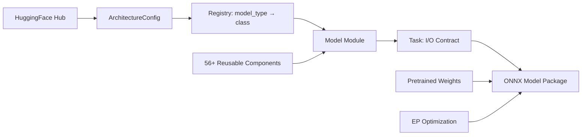
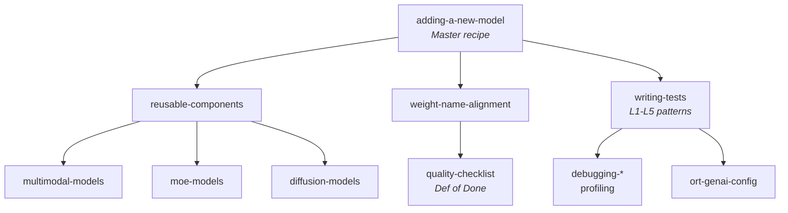

# Mobius

## Standardized ONNX Construction for GenAI at Scale

<div class="pt-6">
  <span class="text-xl text-gray-500">
    Justin Chu · Microsoft
  </span>
</div>

<!--
Hi, I am Justin, a software engineer at Microsoft working on our inference and optimization stack for edge AI.

At Microsoft, we use ONNX as both the starting point for optimizing AI models, and as the format we deliver those optimized models in.

To acquire ONNX models, we have been relying on the PyTorch exporter to trace the model architecture and convert the operators into ONNX — typically starting from models on Hugging Face. You may have experience the pain of exporting a model from PyTorch. As a maintainer of the exporter, I share your pain: model exporting is still hard.
-->

---
layout: center
---

# The Problem

<!--
- Visual break — pain points unpack on the next slide

[Visual break. The bullets on the next slide unpack the pain points.]
-->

---

# The Challenge at Scale

<div class="grid grid-cols-5 gap-3 mt-10">

<div v-click class="border-2 border-red-200 rounded-lg p-4 text-center bg-red-50">
<div class="font-bold text-red-600">Dynamic shapes</div>
<div class="mt-2 text-xs text-gray-600">Shapes specialized at runtime, which breaks export</div>
</div>

<div v-click class="border-2 border-red-200 rounded-lg p-4 text-center bg-red-50">
<div class="font-bold text-red-600">Unsupported operators</div>
<div class="mt-2 text-xs text-gray-600">Control flow, Python-only logic, new PyTorch ops</div>
</div>

<div v-click class="border-2 border-red-200 rounded-lg p-4 text-center bg-red-50">
<div class="font-bold text-red-600">Graph cleanup & fusion</div>
<div class="mt-2 text-xs text-gray-600">Patterns shift with <code>transformers</code> / PyTorch, vary across models</div>
</div>

<div v-click class="border-2 border-red-200 rounded-lg p-4 text-center bg-red-50">
<div class="font-bold text-red-600">Signature / architecture changes</div>
<div class="mt-2 text-xs text-gray-600">I/O & tensor-layout tweaks to fit ONNX conventions</div>
</div>

<div v-click class="border-2 border-red-200 rounded-lg p-4 text-center bg-red-50">
<div class="font-bold text-red-600">Quantized models</div>
<div class="mt-2 text-xs text-gray-600">Low-bit representations have no standard traceable form</div>
</div>

</div>

<!--
Now, to convert these models into ONNX using the Torch exporter, conversion is still hard for a few reasons:

- **Dynamic shapes** - models specializes shape information in runtime (breaks export)
- **Unsupported operators** - control flow, Python-only logic, new PyTorch ops
- **Graph clean up and node fusion** - patterns change with `transformers` and PyTorch updates / varies among models
- **Model signature / architecture changes** Some models require input/output/tensor layout changes to fit onnx conventions
- **Quantized models** Low-bit representation doesn't have a standard tracible representation
-->

---

# The Deeper Problem: Fragmentation

<div class="grid grid-cols-4 gap-3 mt-10">

<div v-click class="border-2 border-gray-300 rounded-lg p-4 text-center">
<div class="font-bold">No single source of truth</div>
<div class="mt-2 text-xs text-gray-600">Same model, different ONNX graphs depending on who exported it</div>
</div>

<div v-click class="border-2 border-gray-300 rounded-lg p-4 text-center">
<div class="font-bold">Structural inconsistency</div>
<div class="mt-2 text-xs text-gray-600">CUDA export ≠ WebGPU export ≠ CPU export</div>
</div>

<div v-click class="border-2 border-gray-300 rounded-lg p-4 text-center">
<div class="font-bold">Quality variance</div>
<div class="mt-2 text-xs text-gray-600">Some exports work, some silently produce wrong outputs</div>
</div>

<div v-click class="border-2 border-gray-300 rounded-lg p-4 text-center">
<div class="font-bold">Duplicated effort</div>
<div class="mt-2 text-xs text-gray-600">Every team re-discovers the same export pitfalls</div>
</div>

</div>

<div v-click class="mt-10 p-4 bg-blue-50 rounded-lg text-center text-xl">
We need <strong>canonical constructions</strong> for similar model types.
</div>

<!--
- No single source of truth, making harder to make assumptions on optimization
- Leads to longer development time
- We miss optimization opportunities — models carry patterns the optimizers don't know
- → need a way to ensure canonical constructions, avoid fragmentation

All of this leads to longer development time, and we miss optimization opportunities whenever a model carries patterns the optimizers don't recognize. That's why we need a way to guarantee canonical constructions and avoid fragmentation.
-->

---

# The Paradigm: Construction

<div class="grid grid-cols-2 gap-8 mt-8">

<div class="border-2 border-gray-300 rounded-lg p-4">

### Translation (Export)

```
PyTorch Model
    ↓ trace
Intermediate Repr
    ↓ convert ops
ONNX Graph
    ↓ cleanup / fusion / graph transform
ONNX Model
```

Great for general purpose.
Model-code dependent. Hard to standardize.

</div>

<div class="border-2 border-green-300 rounded-lg p-4">

### ✅ Construction

```
HuggingFace Config
    ↓ read architecture
ONNX Graph (declarative)
    ↓ apply weights
ONNX Model
```

Deterministic. Composable.
**One canonical output per architecture.**

</div>

</div>

<!--
- Whereas we translated the models and were constrained by modeling code and the PyTorch framework, we started to explore directly constructing these models based on what we know about the model architecture and what we expected as the eventual clean ONNX representation.
- This is the approach pioneered by the Model Builder in ONNX Runtime GenAI
-->

---

# From Curated to Community Scale


<ScaleAnimation />

<v-click>

<div class="mt-6 text-center text-2xl font-bold text-blue-500">
How do we scale construction to the entire ecosystem?
</div>

</v-click>

<!--
With Model Builder we can build ~20 text-to-text architectures.<br>
But the HuggingFace ecosystem has **300+** across every modality.

We know construction is the right direction, but there aren't enough hands.

**\<click\>**

How do we scale construction to the entire ecosystem?
-->

---
layout: center
class: text-center
---

# The Answer

<div class="text-2xl text-gray-500 mt-4">
Design construction for AI — from the ground up.
</div>

<!--
- To open the top of the funnel for the ONNX ecosystem + make device-targeted optimization easier
- Need to scalably bring models into ONNX + a stable, uniform starting representation, regardless of architecture
- Our answer: scale using AI agents — design for agentic development from day one
- That's what Mobius does

To open the top of the funnel for the ONNX ecosystem, and to make device-targeted optimization easier, we need a way to scalably bring models into ONNX — and provide a stable, uniform representation as the starting point, regardless of model architecture.

That's what Mobius does.
-->

---

# What Is Mobius?

<div class="mt-4 text-lg">

**ONNX model definitions for GenAI using `onnxscript.nn`**

</div>

```python
from mobius import build

# That's it. One line.
pkg = build("google/gemma-4-12B-it")
pkg.save("output/gemma-4-12b/")
```

<v-clicks>

- 📦 **130+** Transformers model types
- 🎯 **56+** reusable components
- 🖥️ **EP-aware** optimization (CUDA, WebGPU, XPU)
- 🧠 **Memory efficient** — builds models in <1x RAM

</v-clicks>

<!--
- Mobius = ONNX model definitions for GenAI, built with the onnxscript.nn API
- One call: build a HF model ID → save the package; weights downloaded & applied automatically
- Four proof points (unpack next): breadth (130+ types), reuse (56+ components), EP-aware, memory trick

This is the payoff slide for the setup. Mobius is ONNX model definitions for GenAI written with the onnxscript.nn API. From the user's side it's one call: build a HuggingFace model ID, save the package. Weights are downloaded and applied automatically.

The four numbers are the proof points we'll unpack next: breadth (130+ Transformers model types), reuse (56+ components), runtime-awareness (EP optimization), and the memory trick that makes huge models buildable on a laptop.
-->

---

# Architecture



<!--
- Pipeline top→bottom: HF config → ArchitectureConfig → registry (model_type → class) → model from components → Task (I/O contract, KV cache) → weights + EP optimization → ONNX package
- Every box is a stable seam: swap a model without touching components; add a task without touching models

Walk the pipeline top to bottom. A HuggingFace config comes in and becomes an ArchitectureConfig. The registry maps the model_type string to a model class. That model is composed from shared components. A Task defines the I/O contract — inputs, outputs, KV cache. Then pretrained weights and EP-specific optimization produce the final ONNX package.

The key point: every box is a stable seam. You can swap a model without touching components, or add a task without touching models.
-->

---

# Four-Layer Stack

| Layer | What | Example |
|-------|------|---------|
| **Components** | Model-agnostic building blocks | Attention, MLP, RMSNorm, RoPE, MoELayer |
| **Models** | Architecture-specific modules | LlamaCausalLM, Qwen3VL, DeepSeekV3 |
| **Tasks** | Define I/O contract + KV cache | CausalLMTask, VisionLanguageTask |
| **Registry** | Maps HF `model_type` → class | `"llama"` → `CausalLMModel` |

<div class="mt-6 text-center">

Many models need **one line** to register:

```python
registry.register("my_new_model", CausalLMModel)
```

</div>

<!--
- Components: model-agnostic building blocks
- Models: architecture-specific compositions
- Tasks: own the I/O contract + KV cache
- Registry: HF model_type → class
- Punchline: many models are LLaMA-shaped → adding them is one registry line; that's why coverage scales

These are the same four boxes, but now as the layered abstraction. Components are model-agnostic building blocks. Models are architecture-specific compositions. Tasks own the I/O contract and KV cache behavior. The registry is the lookup from a HuggingFace model_type to the right class.

The punchline is the bottom: many models are LLaMA-shaped, so adding them is literally one registry line. That's why coverage scales — most new models reuse an existing composition.
-->

---

# Memory Efficiency: Build 70B in <100MB

<v-clicks>

### The trick: shape-only parameters

```python
class Linear(nn.Module):
    def __init__(self, in_features, out_features):
        # ZERO bytes allocated! Only shape recorded.
        self.weight = nn.Parameter([out_features, in_features])
```

### Two-phase architecture

| Phase | Memory | What happens |
|-------|--------|-------------|
| **1. Graph Construction** | ~100MB | Shape-only placeholders, build full ONNX graph |
| **2. Weight Application** | Streaming | Download shards, apply via LazyTensor |

### `ir.LazyTensor` — deferred until serialization

- Dtype casts → closure, not immediate copy
- Transposes → lazy, folded at save time
- Tied embeddings → deduplicated via `data_ptr()`

</v-clicks>

<!--
- Trick: we build a graph, not run a model → params need shape, not data → Linear allocates zero bytes
- Two-phase: full graph with shape-only placeholders (~100MB, any size) → stream weight shards, attach lazily
- ir.LazyTensor defers casts / transposes / tied-weight dedup until serialization → never hold the whole model
- Result: 70B builds in <100MB RAM — on a laptop

This is the engineering trick that makes construction practical. Because we're building a graph, not running a model, parameters only need their shape, not their data — so a Linear layer allocates zero bytes.

That gives a two-phase build: first construct the full graph with shape-only placeholders (~100MB regardless of model size), then stream weight shards in and attach them lazily. ir.LazyTensor defers casts, transposes, and tied-weight dedup until serialization, so we never hold the whole model in memory. Net result: a 70B model builds in under 100MB of RAM — on a laptop.
-->

---

# Designed for Parallel Development

<div class="mt-4 text-lg">

The architecture is **designed for parallel AI agent development**.

</div>

<v-clicks>

- 📁 **One model = one file** — no cross-model dependencies
- 🧩 **Shared components are stable** — compose from them, rarely need to change them
- 🧪 **Independent test suites** — each model validates in isolation
- 📚 **19 structured skills** — agents follow the same playbook humans would
- 📋 **Declarative golden tests** — adding coverage = adding a YAML file

</v-clicks>

<!--
- Shaped so many agents (or people) work at once without colliding
- One model = one file, no cross-model imports → no conflicts
- Shared components stable → compose, don't edit
- Per-model isolated tests
- Skills + declarative golden tests → agents follow the same playbook a human would

The architecture isn't just clean — it's deliberately shaped so many agents (or people) can work at once without colliding. One model lives in one file with no cross-model imports, so two models never conflict. Shared components are stable, so you compose from them instead of editing them. Tests are per-model and isolated. And the skills plus declarative golden tests mean an agent follows the same playbook a human would.
-->

---

# EP-Aware Optimization

```python
from mobius import build

# CUDA: GQA fusion, SkipLayerNorm, PackQKV
pkg = build("meta-llama/Llama-3.2-1B",
            execution_provider="cuda", dtype="f16")

# WebGPU: portable alternatives, no CUDA-only ops
pkg = build("meta-llama/Llama-3.2-1B",
            execution_provider="webgpu", dtype="f16")

# DirectML: Windows-optimized graph
pkg = build("meta-llama/Llama-3.2-1B",
            execution_provider="dml", dtype="f16")
```


<v-click>

<div class="mt-4 text-sm text-gray-500">

🔧 Under the hood: **10 declarative rewrite rules** (GQA fusion, SkipLayerNorm, BiasGeLU, PackedAttention, RoPE separation...) pattern-match and transform the graph — like LLVM passes for ONNX.

</div>

</v-click>

<v-click>

<div class="mt-3 text-sm text-gray-500">

⚙️ **Bring your own EP** — `register_ep(EpCapabilities(...))` adds a target without forking: control GQA/QKV fusion, lowering passes, RoPE, MoE support, KV-cache caps.

</div>

</v-click>

<!--
- Same model ID, same one-line API — only the target changes
- CUDA: GQA fusion, SkipLayerNorm, PackQKV
- WebGPU: portable alternatives, no CUDA-only ops
- DirectML: Windows-optimized graph
- Optimization at build time, not a fragile post-hoc pass
- Under the hood: 10 declarative rewrite rules — like LLVM passes for ONNX; graph born ready for its target
- EP support is extensible: register_ep(EpCapabilities(...)) — not hard-coded, vendors/teams can add their own

Same model ID, same one-line API — the only thing that changes is the target. Pass execution_provider and you get a graph tuned for that runtime: CUDA gets GQA fusion, SkipLayerNorm, PackQKV; WebGPU swaps in portable alternatives with no CUDA-only ops; DirectML gets a Windows-optimized graph.

The important framing: optimization happens at build time, not as a fragile post-hoc pass over an exported model. Under the hood it's 10 declarative rewrite rules that pattern-match and rewrite subgraphs — conceptually LLVM passes for ONNX. The graph is born ready for its target.

And EP support isn't hard-coded — register_ep(EpCapabilities(...)) lets a vendor or internal team add a new target with its own fusion/lowering behavior, without forking Mobius.
-->

---
layout: center
class: text-center
---

# How AI Agents Use Mobius

<div class="text-2xl text-gray-500 mt-4">
The skills, the workflow, the verification.
</div>

<!--
- Section turn: what Mobius is → how an agent actually adds a model
- The skills, the workflow, the verification

Section divider. We've shown what Mobius is and why the architecture is shaped the way it is. Now the part that makes it scale: how an AI agent actually adds a model — the skills it follows, the workflow it runs, and how it verifies its own work.
-->

---

# AI-Assisted Development

<div class="mt-4">

### 19 structured skills for AI agents

</div>



<!--
- Skills aren't loose docs — a structured tree the agent navigates
- adding-a-new-model = master recipe → branches to components, weight alignment, tests → specialized (multimodal / MoE / diffusion) + quality + debugging
- Agent doesn't improvise → output is consistent & reviewable

The skills aren't loose docs — they're a structured tree the agent navigates. adding-a-new-model is the master recipe; it branches into reusable-components, weight-name-alignment, and writing-tests. Those in turn lead to specialized skills for multimodal, MoE, and diffusion models, plus quality checklists and debugging/profiling guides.

The point: the agent doesn't improvise. It follows the same documented playbook an experienced human contributor would, which is exactly why agent output is consistent and reviewable.
-->

---

# What an Agent Does

<v-clicks>

1. **Read** HF `config.json` → identify architecture pattern
2. **Decide** — is it LLaMA-compatible? (→ 1 line) Or novel? (→ new components)
3. **Implement** — compose from existing components, add new ones if needed
4. **Map weights** — align HF checkpoint names → ONNX initializer names
5. **Test** — L1 through L5, self-verifying at each level
6. **Iterate** — fix numerical mismatches until parity

</v-clicks>

<div v-click class="mt-6 p-3 bg-green-50 rounded-lg">

**Key insight:** The composable architecture + consistent patterns make AI agents effective.
A human designs the system; AI scales it.

</div>

<!--
- The agent loop: read HF config → decide LLaMA-compatible (1 line) vs novel (new components) → implement by composing → align weight names → test L1–L5 → iterate to parity
- Key: none of this works without the composable architecture + consistent patterns
- A human designs the system once; AI scales it across hundreds of models

Walk the six steps as the agent's actual loop. It reads the HF config to identify the architecture, decides whether it's LLaMA-compatible (one line) or genuinely novel (new components), implements by composing, aligns weight names, then tests through L1-L5 and iterates until numerical parity.

Land on the insight at the bottom: none of this works without the composable architecture and consistent patterns. A human designs the system once; the AI scales it across hundreds of models.
-->

---

# L1–L5: The Testing Pyramid

<div class="mt-4">

How agents (and humans) verify correctness:

</div>

| Level | What | Speed | Where |
|-------|------|-------|-------|
| **L1** | Graph builds (smoke) | <10s, CPU | Every PR |
| **L2** | Real HF configs, no weights | ~1min, CPU | Nightly |
| **L3** | Synthetic parity (random weights) | ~2min, CPU | PR (affected) |
| **L4** | Golden checkpoint logits | GPU (A10) | PR + Nightly |
| **L5** | Full generation vs golden | GPU (A10) | PR + Nightly |

<div v-click class="mt-4 p-3 bg-yellow-50 rounded-lg">

🔑 **Diff-based CI**: AST analysis detects which models a code change affects → only those get retested. Core infra change? Run all.

</div>

<!--
- Correctness verified cheaply at every level
- L1: graph builds (seconds, CPU, every PR)
- L2: real HF configs, no weights
- L3: synthetic parity, random weights
- L4/L5: GPU — golden logits + full generation vs golden
- Diff-based CI: AST analysis retests only affected models; core infra change → run all

This is how correctness is verified at every level, cheaply. L1 just checks the graph builds — seconds on CPU, runs on every PR. L2 validates against real HF configs without weights. L3 does synthetic parity with random weights. L4 and L5 are the expensive GPU checks: golden-checkpoint logits and full generation against a golden reference.

The diff-based CI is what keeps this affordable: AST analysis figures out which models a change actually affects and only retests those. Touch core infra and it runs everything.
-->

---

# Why This Works for AI

<v-clicks>

### Agents can self-verify

- L1 fails → graph construction bug (shape mismatch, missing param)
- L3 fails → numerical error (wrong op, wrong axis, scaling bug)
- L4/L5 fails → weight loading or accumulation issue

### Each level is a clear diagnostic signal

The agent doesn't just run tests — it **knows what a failure means** and can fix it.

</v-clicks>

<!--
- Each level maps to a distinct failure class — a failure is a diagnostic, not just red
- L1 → graph construction bug
- L3 → numerical error
- L4/L5 → weight loading / accumulation
- Agent knows where to look → closes the loop itself, no human triage

This is the crux of why the testing pyramid matters for agents specifically. Each level maps to a distinct failure class: an L1 failure is a graph-construction bug, an L3 failure is a numerical error, an L4/L5 failure points at weight loading or accumulation. So a test failure isn't just red — it's a diagnostic that tells the agent where to look. The agent closes the loop on its own instead of waiting for a human to triage.
-->

---

# Case Study: PersonaPlex

<div class="mt-4 text-lg">

An **audio-to-audio** model. Not text gen. Not vision. Something ONNX has rarely seen.

</div>

<v-clicks>

### The model

- NVIDIA's real-time full-duplex voice conversation model
- 7B parameters, Moshi architecture
- Audio in → Audio out (no STT→LLM→TTS pipeline)
- Full-duplex: both sides talk simultaneously, natural interruption

### What happened

- AI agent picked it up, classified it as novel (out-of-library)
- Composed new audio components + reused existing attention/norm building blocks
- Built end-to-end ONNX graph + streaming inference server

</v-clicks>

<div v-click class="mt-4 p-3 bg-green-50 rounded-lg text-center">

🎵 The system doesn't just handle <em>more text models</em>. It handles <strong>new modalities</strong> the same way.

</div>

<!--
- Proof it generalizes beyond text — audio-to-audio
- NVIDIA full-duplex voice, Moshi architecture, 7B, audio in → audio out, no STT-LLM-TTS pipeline; ONNX rarely sees this
- Agent: classified novel → composed new audio components, reused attention/norm → end-to-end graph + streaming server
- 2 days, fully tested → new modality, same workflow as the hundredth text model

This is the proof that the approach generalizes beyond text. PersonaPlex is audio-to-audio — NVIDIA's full-duplex voice model on the Moshi architecture, 7B params, audio in and audio out, no STT-LLM-TTS pipeline. It's exactly the kind of thing ONNX rarely sees.

An agent picked it up, classified it as novel, composed new audio components while reusing existing attention and norm blocks, and produced an end-to-end graph plus a streaming inference server in two to three days, fully tested. The takeaway: a brand-new modality went through the same workflow as the hundredth text model.
-->

---

# Out-of-Tree Models

<div class="mt-4 text-lg">

Third parties can build their private models with Mobius — and get the same optimized path for free.

</div>

```python
from mobius import registry
from mobius.components import Attention, RMSNorm, MLP, RotaryEmbedding

class MyProprietaryModel(CausalLMModel):
    # Compose from 56+ battle-tested components
    def __init__(self, config):
        self.attn = Attention(config)      # ← same as Llama/Qwen
        self.norm = RMSNorm(config)        # ← same as Gemma
        self.mlp = MLP(config)             # ← same as Phi
        self.rope = RotaryEmbedding(config)

registry.register("my_secret_model", MyProprietaryModel)
```

<v-clicks>

- 🔧 **Reusable components** — don't reinvent Attention/MLP/RoPE, just compose
- ⚡ **EP optimizations come free** — GQA fusion, SkipLayerNorm, etc. apply automatically
- 🔒 **Keep weights private** — only the architecture definition is needed at build time
- 📦 **Any weight format** — SafeTensors, PyTorch `.bin`, GGUF, NeMo → one canonical ONNX
- 🧪 **Same L1-L5 test infra** — validate your model with the same pipeline we use

</v-clicks>

<div v-click class="mt-6 p-3 bg-blue-50 rounded-lg text-center">

🔄 <strong>Flywheel:</strong> Third parties use components → find bugs, add ops → components get better → more models adopt them → repeat.

</div>

<!--
- Not just our models — third parties build private architectures, same optimized path for free
- Compose from the same components; EP optimizations inherited automatically
- Weights stay private (only architecture definition needed at build); any weight format; same L1–L5 infra
- Flywheel: external users exercise components → find bugs, add ops → components improve → more models adopt → repeat

Mobius isn't only for the models we ship — third parties can build their own private architectures against it and get the same optimized path for free. They compose from the same battle-tested components, inherit EP optimizations automatically, keep their weights private (only the architecture definition is needed at build time), bring any weight format, and validate with the same L1-L5 infra.

Close on the flywheel: external users exercise the components, find bugs and add ops, the components improve, and more models adopt them. The ecosystem compounds.
-->

---

# Coverage

<div class="grid grid-cols-2 gap-6 mt-4">

<div>

| Category | Examples |
|----------|---------|
| **Text Gen** | Llama 2/3/4, Qwen 2-3.6, Phi, Gemma, GPT-2 |
| **MoE** | DeepSeek-V2/V3, Mixtral, Qwen-MoE, DBRX |
| **Multimodal** | Gemma 4, Phi-4MM, Qwen-VL, LLaVA |
| **Encoder** | BERT, RoBERTa, DeBERTa, XLNet |

</div>

<div>

| Category | Examples |
|----------|---------|
| **Enc-Dec** | T5, BART, Whisper, Marian |
| **Audio** | Wav2Vec2, Nemotron, SpeechT5, PersonaPlex |
| **Vision** | ViT, CLIP, SigLIP, DINOv2 |
| **Diffusion** | Stable Diffusion, Flux, SD3, DiT |

</div>

</div>

<div class="mt-6 text-center text-2xl font-bold">
130+ model types · 56+ components · 40+ task types
</div>

<!--
- Breadth across every modality — all through the same construction path
- PersonaPlex now sits in Audio next to Wav2Vec2 / Whisper
- Headline: 130+ model types · 56+ components · 40+ task types — one canonical construction each

Don't read the table — let it land visually. The point is breadth across every modality: text gen, MoE, multimodal, encoders, encoder-decoders, audio, vision, and diffusion all go through the same construction path. Note that PersonaPlex now sits in the Audio column alongside Wav2Vec2 and Whisper.

The bottom line is the headline number: 130+ model types, 56+ shared components, 40+ task types — one canonical construction each.
-->

---

# Summary

<v-clicks>

1. **Build for standardization** — declarative ONNX construction, one canonical output per architecture
2. **Memory efficient** — shape-only params + LazyTensor = build any model size
3. **AI-native** — 18 skills + L1-L5 testing let agents add models autonomously
4. **EP-aware** — born optimized for your target runtime
5. **Composable** — 56+ components shared across 130+ architectures

</v-clicks>

<div v-click class="mt-8 text-center text-xl">

Coming this summer. Pairs with Olive for end-to-end optimization.

</div>

<!--
- Build for standardization, not translation — one canonical output per architecture
- Memory efficient: shape-only params + LazyTensor → any model size
- AI-native: skills + L1–L5 → agents add models autonomously
- EP-aware: born optimized for the target runtime
- Composable: 56+ components across 130+ architectures
- Availability: coming this summer; pairs with Olive for end-to-end optimization

Five takeaways, one per click. Build for standardization, not translation. Memory efficiency makes any model size buildable. AI-native means agents add models autonomously, backed by skills and L1-L5 testing. EP-aware means born optimized for the target runtime. And composability ties it together — 56+ components across 130+ architectures.

Close on availability: coming this summer, and it pairs with Olive for the end-to-end optimization story.
-->

---
layout: center
class: text-center
---

# Thank You

Questions?

<div class="mt-8 text-gray-500">
Justin Chu · justinchuby
</div>

<!--
- Q&A — be ready for: construction vs torch.export in practice; weight-name alignment across checkpoint formats; EP coverage beyond CUDA/WebGPU/DirectML; how out-of-tree teams start
- Pairs with Olive for end-to-end device optimization

Thanks — happy to take questions. Good things to be ready for: how construction compares to torch.export in practice, how weight-name alignment is handled across checkpoint formats, what the EP coverage looks like beyond CUDA/WebGPU/DirectML, and how out-of-tree teams get started. Mention it pairs with Olive for end-to-end device optimization.
-->
